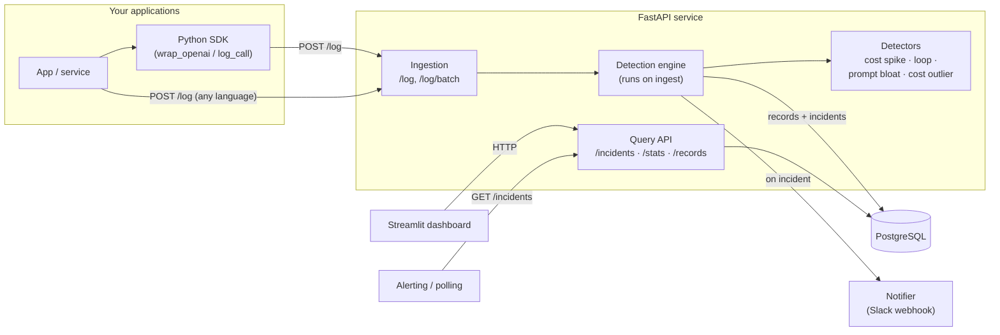

# LLM Cost Anomaly Detector

Real-time monitoring for LLM API usage that flags cost anomalies — infinite
loops, prompt bloat, runaway token usage, and cost spikes — **before they blow
up your bill**.

LLM costs spike silently: a retry loop hammering an endpoint, a prompt that
keeps growing as context accumulates, an agent stuck in a tool-call cycle. This
service ingests every LLM call, baselines normal usage per endpoint/user, and
raises incidents in near real time — with a dashboard to see what happened and
why.

---

## Features

- **Ingestion API** — `POST /log` for any app/language, plus a lightweight Python
  SDK that can auto-log OpenAI/Anthropic client calls.
- **Statistical detection** (no ML required, model-based detectors pluggable):
  - **Cost spike** — z-score on per-endpoint, time-bucketed cost (volume surge).
  - **Loop signature** — repeated identical calls (infinite loop / retry storm).
  - **Prompt bloat** — a caller's input tokens ballooning vs their recent median.
  - **Cost outlier** — a single runaway call far above the endpoint baseline.
- **Materiality floor + cooldown** — no paging on sub-cent noise; one incident
  per sustained anomaly, not a flood.
- **Alerting** — incidents are pollable via `GET /incidents` and pushed to Slack
  when a webhook is configured.
- **Dashboard** — Streamlit UI: cost over time, cost by model/endpoint, flagged
  incidents, and a drill-down into the request pattern behind each incident.
- **Reproducible eval** — seeded synthetic traffic with injected anomalies, scored
  for precision/recall, time-to-detection, and false-positive rate.

## Architecture



**Detection runs synchronously on ingest** for the lowest possible
time-to-detection. Each detector implements a small `BaseDetector` interface, so
a future model-based detector drops in without touching the API or engine.

## Data model

- **`call_records`** — every LLM call: `ts, provider, model, endpoint, caller,
  tokens_in/out, total_tokens, cost_usd, latency_ms, request_hash, status, meta`.
  Indexed on `(endpoint, ts)`, `(caller, ts)`, `(request_hash, ts)`.
- **`incidents`** — `type, severity, scope (endpoint/caller/…), trigger_record_id,
  score, baseline, observed, window, message, status, notified`.

`cost_usd` is computed from a per-model price table (`app/pricing.py`) when the
caller doesn't supply it; `request_hash` is a normalized hash of the prompt used
as the loop signature.

## Quickstart (Docker)

```bash
cp .env.example .env        # then edit as needed (OPENAI_API_KEY optional)
docker-compose up --build
```

- API → http://localhost:8000  (docs at `/docs`)
- Dashboard → http://localhost:8501

Send a test call:

```bash
curl -X POST http://localhost:8000/log -H "Content-Type: application/json" -d '{
  "provider": "openai", "model": "gpt-4o-mini",
  "endpoint": "/chat", "caller": "svc-a",
  "tokens_in": 1200, "tokens_out": 300, "latency_ms": 480
}'
```

### Local (without Docker)

```bash
python -m venv .venv && source .venv/Scripts/activate   # Windows Git Bash
pip install -r requirements.txt
# point DATABASE_URL at a local Postgres (or run just the db via docker-compose)
uvicorn app.main:app --reload
streamlit run dashboard/app.py
```

## SDK usage

```python
from openai import OpenAI
from sdk import CostMonitorClient, wrap_openai

monitor = CostMonitorClient("http://localhost:8000")

# Option A — auto-log every OpenAI call
client = wrap_openai(OpenAI(), monitor, endpoint="/summarize", caller="svc-a")
client.chat.completions.create(model="gpt-4o-mini", messages=[...])  # logged

# Option B — log manually
monitor.log_call(provider="openai", model="gpt-4o-mini",
                 tokens_in=1200, tokens_out=300,
                 endpoint="/summarize", caller="svc-a")
```

`wrap_anthropic` does the same for the Anthropic client. Logging is best-effort:
a logging failure never breaks your LLM call.

## Integrate into your own app or website

Point your app at a running detector instance and log every LLM call. Three ways,
from least to most integrated:

### 1. Python — auto-log an OpenAI/Anthropic client (zero call-site changes)

Copy the `sdk/` folder into your project (it only needs `httpx`), then wrap your
client once:

```python
from openai import OpenAI
from sdk import CostMonitorClient, wrap_openai

monitor = CostMonitorClient("https://your-detector.example.com", api_key="YOUR_API_KEY")
client = wrap_openai(OpenAI(), monitor, endpoint="/summarize", caller="user-123")

# use the client exactly as before — every call is logged automatically
client.chat.completions.create(model="gpt-4o-mini", messages=[...])
```

`wrap_anthropic(anthropic_client, monitor, ...)` does the same for Anthropic.

### 2. Python — log manually where you already have usage numbers

```python
monitor.log_call(
    provider="openai", model="gpt-4o-mini",
    tokens_in=1200, tokens_out=300,
    endpoint="/summarize", caller="user-123",
    latency_ms=480,                 # optional
    prompt=messages,                # optional; used for loop detection
)
```

### 3. Any language / framework — POST to `/log`

No SDK needed. After each LLM call, fire one HTTP request (Node/JS shown; works
from Go, Ruby, PHP, a Cloudflare Worker, anywhere):

```js
await fetch("https://your-detector.example.com/log", {
  method: "POST",
  headers: { "Content-Type": "application/json", "X-API-Key": "YOUR_API_KEY" },
  body: JSON.stringify({
    provider: "openai", model: "gpt-4o-mini",
    endpoint: "/summarize", caller: "user-123",
    tokens_in: 1200, tokens_out: 300, latency_ms: 480,
  }),
});
```

`cost_usd` is optional — omit it and the server computes it from the model. Send
`prompt` (string or messages array) to enable loop detection, or precompute
`request_hash` yourself. Logging should be **fire-and-forget**: never block or
fail your user's request on it.

Then read anomalies back however you like: poll `GET /incidents`, wire a Slack
webhook (`SLACK_WEBHOOK_URL`), or watch the dashboard.

## API reference

| Method | Path | Purpose |
|---|---|---|
| `POST` | `/log` | Ingest one call; runs detection, returns any incidents |
| `POST` | `/log/batch` | Bulk ingest |
| `GET` | `/incidents` | List incidents (filter by `status`, `type`, `scope_value`, `since`) |
| `GET` | `/incidents/{id}` | Incident + surrounding request pattern (drill-down) |
| `GET` | `/records` | Query raw call records |
| `GET` | `/stats/summary` | Totals + open-incident count |
| `GET` | `/stats/cost-over-time` | Time-bucketed cost (`granularity=minute\|hour\|day`) |
| `GET` | `/stats/cost-by-model` · `/stats/cost-by-endpoint` | Grouped cost |
| `GET` | `/healthz` | Liveness |

## Simulation & evaluation

Generate seeded synthetic traffic (normal + four injected anomalies) and score
the detector against ground truth:

```bash
python -m simulation.run_eval --seed 42     # writes eval/report.{md,json}
```

Send generated traffic to a running service (add `--live` to use real OpenAI
token counts, requires `OPENAI_API_KEY`):

```bash
python -m simulation.generator --send --api http://localhost:8000
```

**Representative results** (seeds 7/42/123/2024): **recall 1.00** on all injected
anomalies with **precision 0.75–1.00**; time-to-detection ranges from instant
(cost outlier) to the 10th call (loop, matching the configured threshold). The
occasional false positive is a genuine 3.5σ tail event on normal traffic.
Scoring matches each incident to an anomaly via the trigger record's ground-truth
label, so precision/recall are unambiguous.

## Testing

```bash
pytest -q
```

- **Unit** — statistical helpers and each detector (fires on anomalies, stays
  quiet on normal traffic, respects min-samples), on in-memory SQLite.
- **Integration** — ingestion, the full anomaly→incident→drill-down→alert flow,
  cooldown dedup, the SDK, and the dashboard stats endpoints.

## Configuration

Everything is environment-driven (see `.env.example`) — no code changes to tune.

| Variable | Default | Purpose |
|---|---|---|
| `DATABASE_URL` | local Postgres | SQLAlchemy connection string |
| `API_URL` | `http://localhost:8000` | where the dashboard finds the API |
| `API_KEY` | _(empty)_ | when set, all data endpoints require `X-API-Key` |
| `OPENAI_API_KEY` | _(empty)_ | only for `--live` synthetic traffic |
| `SLACK_WEBHOOK_URL` | _(empty)_ | push incidents to Slack when set |
| `Z_SCORE_THRESHOLD` | `3.5` | outlier sensitivity (cost spike / outlier) |
| `IQR_MULTIPLIER` | `1.5` | Tukey-fence width for outliers |
| `MIN_SAMPLES` | `8` | min baseline samples before a detector fires |
| `LOOP_COUNT_THRESHOLD` | `10` | identical calls that count as a loop |
| `LOOP_WINDOW_SECONDS` | `60` | window for loop counting |
| `COST_SPIKE_BUCKET_SECONDS` | `60` | time bucket for spike aggregation |
| `BASELINE_WINDOW_SECONDS` | `3600` | rolling baseline lookback |
| `TOKEN_GROWTH_RATIO` | `4.0` | tokens vs median that counts as prompt bloat |
| `MIN_INCIDENT_COST_USD` | `0.05` | materiality floor for cost incidents |
| `COOLDOWN_SECONDS` | `300` | suppress duplicate incidents per scope+type |

## Deployment

The stack is container-first:

```bash
cp .env.example .env
# set API_KEY to a strong secret, point DATABASE_URL at managed Postgres,
# optionally set SLACK_WEBHOOK_URL
docker-compose up --build -d
```

Production checklist:

- **Set `API_KEY`.** With it configured, every data endpoint requires the
  `X-API-Key` header (the SDK and dashboard pick it up from env automatically).
- **Terminate TLS** at a reverse proxy (nginx / Caddy / cloud LB) in front of the
  API and dashboard; don't expose them plaintext.
- **Use managed Postgres** (RDS / Cloud SQL / Supabase) via `DATABASE_URL` instead
  of the bundled container for durability and backups.
- **Secrets** come from the environment at runtime; `.dockerignore` keeps `.env`
  out of the image. Prefer your platform's secret store over a committed file.
- **Scale** the API horizontally (multiple `uvicorn`/gunicorn workers or replicas)
  behind the load balancer; state lives entirely in Postgres. The `api` service
  has a `/healthz` healthcheck for orchestrators.
- **Restrict the dashboard** — it's an internal tool; keep it behind auth/VPN.

The same image runs both services (different `command`s), so it deploys cleanly to
anything that speaks Docker: Compose, ECS, Cloud Run, Fly.io, Kubernetes.

## Project structure

```
app/           FastAPI service: routers, models, detection engine, alerting
sdk/           Python client + OpenAI/Anthropic auto-logging wrappers
dashboard/     Streamlit dashboard
simulation/    Synthetic traffic generator + eval harness
tests/         Unit + integration tests
```

Schema is created on startup via SQLAlchemy `create_all` (portable to SQLite for
tests); add Alembic if you need versioned migrations.

## License

MIT
